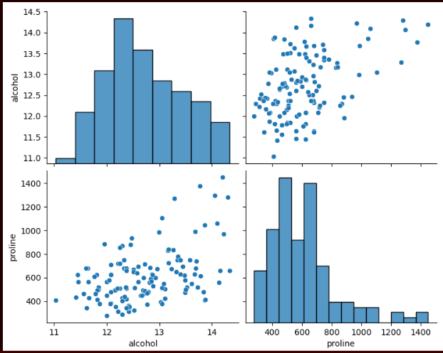
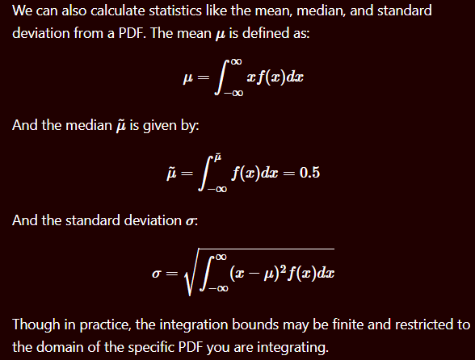
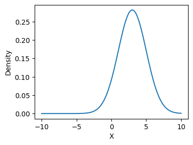
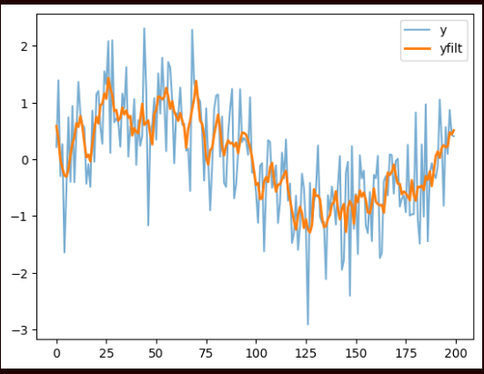
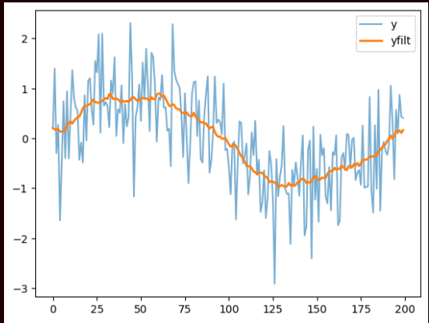

# Python refresher for data science/general needs

(Jupyter Notebooks taken from Prof. Galen Egan's Foundations of Data Science course, Seattle University 2024)

(exercises completed by me)

## Table of Contents
1. [Python Fundamentals](#python-fundamentals)
2. [Data Manipulation](#data-manipulation)
3. [Data Visualization](#data-visualization)
4. [Data Preparation](#data-preparation)


## Python Fundamentals
1. [Basics](#basics)
2. [Var assignment + data types](#var-assignment--data-types)
3. [Strings](#strings) 
4. [Lists](#lists)
5. [Sets](#sets)
6. [Tuples](#tuples)
7. [Dictionaries](#dictionaries)
8. [Flow control](#flow-control)
9. [Functions and classes](#functions-and-classes)


### Basics
- What is Python?
  - High-level language; interpreted (don’t need to compile code before running it) and dynamically-typed (type errors not checked before runtime -> runtime failures can occur)
- What is Jupyter Notebook?
  - Nice for combining text (supports both Markdown and latex) with code
    - Either text or code can go into a cell
  - Code gets executed via Python interpreter (or kernel) on current machine
  - Execute a current code cell via Shift + Enter


### Var assignment + data types
- Integers, floating point numbers
- F-strings: ```print(f”string string2 {var substitution}”)```
- Check data type of variable: type(<variable>)
- Simple math
  - Specialized arithmetic
    - ```//``` : “floor” of a floating point value result
    - ```%```: integer remainder of a floating point value result
    - ```X ** y```: x to the power of y (exponent)
- The Py “math” module
  - What is a module? A collection of functionality that can be imported/used in script
    - ```import <module>```, so import math at top of script
  - ```math.xxx``` (```xxx``` being the name of the variable, function, or other object)
  - ```math.pi```
  - ```math.sqrt(<num>)```
  - ```math.sin(x), math.cos(x), math.exp(x)``` (i.e. e^x), ```math.log(x), math.log(x, y)```
  - ```math.expm1(x)``` - avoids loss of precision involved specifically in ```e^x - 1``` calculations, when ```x``` is very small (e.g. ```x = 10-20```)
  - E.g. sin^2(2) + cos^2(2) -> ```(math.sin(2) ** 2) + (math.cos(2) ** 2)```
  - E.g. sin(2 * pi) -> ```math.sin(2 * math.pi)``` = -2.4492935982947064e-16)
    - Why? We expected 0; due to *Floating-point precision limitations*
      - pi is an irrational number with infinite decimal places, and Python’s math.pi is 64-bit floating-point approximation accurate to 15-17 decimals -> when multiplying with something else, ultimately multiplying by approximation, leading to a tiny rounding error
      - What if we need to check if a result is 0 (when dealing with floating-point prec. limitations? 
        - ```math.isclose(result, 0, abs_tol=1e-9)```
        - We can also round the result (```round(math.sin(2*math.pi), 10) # returns 0.0```)
        - What if we need to deal with exact values throughout a whole calculation set? ```sympy``` library
          - Install and import sympy (don’t use math as pi’s library)
            - E.g. ```sympy.sin(2 * sympi.pi)``` -> 0
- What if we need help with a function (i.e. don’t understand what it does)?
  - ```math.<func name>?``` -> execute cell, returns a documentation string # This didn’t work…but just hover over mystery fn next time?


### Strings
- Python has different "flavors" of strings to hold characters
- Concatenation: ```<string1> + <string2>``` -> <string1string2>
- Replace: ```.replace(<part of str to be replaced in original str>, <replacement>)```
- Capitalize full string: ```.upper(str)```
- Get index (0-indexed) of a char or start of substring in a string: ```.index("substr")```
- How do we split a string? Use desired char to split on, then ```str.split("<splitter>")```
  - Should return a ```List``` of the substrings that were split up
  - Does NOT mutate the original string
- How do we get the last element of a List? ```list[-1]```


### Lists
- Lists (in Python) are:
  - Mutable
  - Ordered
  - Container objects (can store other 'objects' (of different types))
  - 0-indexed 
- Initialized with ```[ ]``` square brackets
- Length of list: ```len(my_list)```
- As mentioned: get the last element of a List via ```list[-1]```
- How do we access _multiple elements_ at a time? *Slicing* via ```:``` operator
  - E.g. ```my_list[:2]``` will return everything from 0 _up to_ (and not including) 2
  - E.g. ```my_list[2:]``` will return everything from 2 up to the end of the list (included)
- How do we _extract_ elements N at a time? Via ```::``` operator
  - E.g. ```my_list[::N]```
  - For every extraction, start from current index + 1, move forward N times, then extract
    - 
- Copy existing list into new list (shallow copy)
  - Slicing: ```list_b = list_a[:]```
  - ```list()``` constructor: ```list_b = list(list_a)```
  - ```.copy()``` (Python 3.3+): ```list_b = list_a.copy()```
  - List comprehension (i.e. using one-line for loop): ```list_b = [item for item in list_a]```
- Deep copy list: need ```deepcopy``` from ```copy``` module
  - For nested objects (e.g. nested lists)
- List examples:
  - What does this return? ```all(item in list_a for item in list_b)```
    - True
    - Grabs an item from list_b and checks if it exists in list_a
    - all() only returns True if every comparison returns True
    - Nested loop (bad complexity)

### Sets
- A list but restricted to unique elements only
- ```set(list_x)```: returns a set of unique values
- ```set_1.union(set_2)```: returns a unified set
- ```set_1.intersection(set_2)```: returns intersection
- ```set_1.symmetric_difference(set_2)```: returns the opposite of intersection

### Tuples
- An _immutable_ list
Initialized with ```( )``` parentheses
- Trying to update an element will throw an error
- Slicing works the same as for a list


### Dictionaries
- A list but each element being a key-value pair
- Access values by passing in the corresponding key
- Initialized with ```{ }``` curly brackets
  - e.g. for element in sample_dict of "key_1: value_1", ```sample_dict[key_1]``` should return ```value_1```
- Keys can be integers or strings
- Keys can be of different types within same dict, but ideally should be same type
  - 
- Particularly useful for storing numerical values associated with easily-remembered descriptions for the values as the keys
- Nested dictionaries: the nested dict can be stored with ```{ }``` as value of k-v pair 
  - Note: Python by default passes only the top-level keys into the loop. Won't have access to key-value pairs by 
    iterating over the dictionary, just the keys (triggering ValueError: too many values to unpack). To loop through
    both keys and values at the same time, you must use the .items() method
  - Correct: 

### Flow control
- Logical operators
  - This is how we handle 'Boolean logic', i.e. handling when things are True or False (reserved keywords)
  - operators:
    - ```a and b```
    - ```a or b```
    - ```not a```
    - ```not a and b```
  - Typically used into control flow within context of ```if/elif/else```
    - ```if a:``` (use colon to start/continue control flow for if/elif)
  - Comparing magnitudes: ```<, >, ==, <=, >=```
  - *Zero or empty collections = false, non-zero = true*
- For loops: for repeating code a *known* number of times
  - ```range(x)```: generates an iterable of integers between 0 and x (non-inclusive)
    - e.g. ```for i in range(10):```
  - Loop through collections (lists, tuples, dicts)
    - Note: must wrap the collection in ```enumerate()``` to make it return both the index AND element
      - e.g. ```a = [10, 9, 8, 7]```
      - ```for index, elem in enumerate(a):```
  - ___ comprehension: shortcut of the for-loop construct
    - List comprehension: create a list
      - E.g. ```b = [i * 2 for i in a]```
    - Dictionary comprehension: create a dict
      - E.g. ```dict_comp = {str(i) + " times 2":i * 2 for i in range(10)}```
        - 
- While loops: for repeating code an *unknown* number of times until condition met
  - ```while <condition>:```


### Functions and classes
- Functions: code reusability (running a section of code more than once whenever function called)
  - ```def <function name>(arguments):```
- Classes
  - An example of OOP; a paradigm where related code bits and functionality are grouped in 'objects'
    - Must be initialized in memory via instantiation for use
    - Declaration
      - ```class <class name>:```
    - Constructor definition: the ```__init__``` function; defines how you initialize an instance of the class
      - By convention, 1st argument of ```__init__``` is always ```self```; refers to the instance of the class
      - e.g. ```def __init__(self, <arg1name=defaultarg1value>, <arg2...>):```
    - Class methods: can be accessed from any class instance
      - Required to pass in ```self``` as argument every time
      - e.g. ```def <method_name>(self):```

[Back to top](#table-of-contents)

## Data Manipulation
1. [Specific package imports](#specific-package-imports)
2. [Pandas: Basics](#pandas-basics)
3. [Pandas: Accessing & slicing DataFrames](#pandas-accessing-and-slicing-dataframes)
4. [Pandas: Merging DataFrames](#pandas-merging-dataframes)
5. [Pandas: Saving DataFrames](#pandas-saving-dataframes)
6. [Pandas: Parsing Data](#parsing-data)
7. [Pandas: Alternatives](#pandas-alternatives)

### Specific package imports
- Pandas: ```import pandas as pd```
- Numpy: ```import numpy as np```
- Scikit-learn: import one class or function at a time as needed (LinearRegression, etc.)

### Pandas: Basics
- Read in a .csv file: ```pd.read_csv(<file path>)```
  - This returns a *DataFrame*; ```df = pd.read_csv(<file path>)```
- What's a DataFrame (df)?
  - Kind of like an object/class that contains useful methods for working with its data
- Create a new df: ```df = pd.DataFrame({})``` (effectively passed in a dictionary)
  - E.g. ```df = pd.DataFrame({'day': [1,2,3,4,5], 'meas': [0.1,0.2,0.3,0.4,0.5]})```
- Printing the df -> gives the rows of the .csv like an Excel sheet
  - The rows could be numbered starting from 0, or in general an array of integers called the *DataFrame index*
  - The index can be ints, strings, times, or anything
  - ```print(df.index)``` -> RangeIndex(start=0, stop=<stop>, step=<increment>)
- How to get the columns of the df?
  - ```print(df.columns)``` -> ```Index(['<col1name>', '<col2name>', ...])``` (array)
- The indices and column names help arrange and label data
- .csv's data can be viewed without its labels: ```df.values``` -> just gives an array of rows
  - Data type of ```df.values``` is ```numpy.ndarray```
    - Under the hood, pandas stores data in Numpy "ndarrays" (short for N-dimensional arrays) that store 
      any # of values; Numpy arrays are a standard data type for storing/performing calculations on data in Python
- Append a row
  - `df = df.loc[<get last row + 1>, <get all rows>] = [new row]`
    - `df = df.loc[df.index.max() + 1, :] = ['john', 20, 1000]`
- Other df helpers
  - ```df.head()```: first 5 rows
  - ```df.tail()```: last 5 rows
  - ```df.shape```: returns (# rows, # cols) of the data
  - How do we find the data types of each col? ```df.dtypes```
  - ...find general info of the df? ```df.info()```
  - ...find general statistical info? ```df.describe()``` - returns count/mean/std/min for columns
    - We can also group by a column and then get statistics on that grouping
      - E.g. ```df.groupby("column_name").describe()```
  - Sort values: ```df.sort_values(by=<col name>, ascending=<false/true>)```
    - E.g. ```iris.sort_values(by="sepal_length", ascending=False).head()```
  - Can also read in .xls (older version of Excel sheet)
    - `pip install xlrd`
    - Direct from package:
      - `book = xlrd.open_workbook("<filepath>")`
      - Methods:
        - `.nsheets`: gets # of worksheets
        - `.sheetnames()`: gets all sheet names
        - Get one sheet by index: `sh = book.sheet_by_index(idx)`
          - Get name, # rows and # cols for a sheet:
            - `sh.name, sh.nrows, sh.ncols`
    - Via Pandas:
      - `df = pd.read_excel('filepath.xls', 'df name', index_col=<...>, na_values=[...])`
- Drop columns: `df.drop([list of col names], axis=1)`
  - Drop values *within* a column (i.e. we don't want any row that contains unwanted values for that column)
    - E.g. for a column `CASE_STATUS`, we don't want to keep any values
      `to_drop = ["INVALIDATED", "REJECTED", "UNASSIGNED"]`
      - `final_dataset = dataset[~dataset['CASE_STATUS'].isin(to_drop)]`

### Pandas: Accessing and slicing DataFrames
Why? Because much of the time we extract the interesting portion of the data, get rid of the rest, use part of the 
  data for training a model, another part for testing the model, and so on. Pandas can help with this

Get a single column's data: ```col = df["column_name"]```
- This data type is ```type(col)``` or a ```Series```, like a 1D DataFrame
- Many methods apply only to Series but not to dfs (e.g. ```.unique()```)
- If no spaces in column name, can directly get column like a property of the DataFrame
  - E.g. `iris.SepalLengthCm`, `iris.Species`

Get multiple columns of data: ```cols_data = df[["col_1_name", "col_2_name"]]```
- Pass in *list* of columns
- Then can run ```.head()```, etc.
- What is the ```type(cols_data)```? df (>1 col)

Get only x number of indices from a df: ```df_x = df.loc[:x]```
- Contrary to list slicing, ```x``` is included in the index (inclusive indexing)
- If indices are NOT integers, would have to specify the indices
  - e.g. for indices "a" and "b", ```df2.loc[["a", "b"]]```
- `.loc`: 1st argument is accessing rows, 2nd argument is accessing columns *by name*
- `.iloc`: both arguments access rows and columns by index

Get certain indices and certain columns (akin to a "sub" df)
- E.g. for indices "a" and "b" and columns "green" and blue": ```df2_2gb = df2.loc[["a", "b"], ["green", "blue"]]```
  - Pass in a list of the indices and a separate list of the cols
  - 

If needing to treat a df like an N-dim. array or list and access contents via int row/col numbers, need ```.iloc()```
- E.g. ```df2_i = df2.iloc[:2, 1:]```, i.e. get all rows up to 2nd, and all cols starting at 1st
- ```.loc[]```: tell pandas to return specific index and column *names*
- ```.iloc[]```: tell pandas to return specific row and column *numbers*

What if we want to get the last (or final) x # of rows of a df? Negative index
- ```df.iloc[-x:]```

What if we wanted to *select* a subset of data *based on a logical condition*? -> Logical slicing
- Format: ```df_subset = df.loc[logical_condition, column_names]```, ```logical_condition``` is array of same length
  as the df index except all elements either ```True``` or ```False```
  - To create ```logical_condition``` array, relate dataframe part of interest to some value with a logical operator
    - E.g. ```logical_condition = df["species"] == "setosa"```
      - ```df["species"] == "setosa"```: using the species column, compares each of its rows' species value to 
        "setosa", effectively returning a column of bools (with indices)
      - 
      - Then use this bool column as argument to ```.loc[]``` to slice
      - (seems like 2nd argument of column/s is optional)
      - 
- Format for multiple comparisons:
  - ```df_subset = df.loc[logical_cond_1 & logical_cond_2, columns_to_show]```
  - Why ```&``` operator instead of ```and```? (using the latter throws ambiguity error)
    - Because pandas overloads the bitwise operator in order to do element-wise filtering, row-by-row
      across the array
  - 

What if we want to slice, column-wise, by the column's name (instead of index)?
- ```df.columns.get_loc("<column_name>")``` -> returns index of column_name, L->R
- E.g. get the final 50 rows of data with only the column named "petal_length" 
  (reminder: index column counts as 0th)
  ```col_idx = df.columns.get_loc("petal_length") ... df_final = df.iloc[-50:, col_idx]```

What if we want to access the value at a particular row/col? 
- `df.iat[<row #>, <col #>]`
  - E.g. `iris.iat[82, 1]` -> np.float64(5.8) (the value at the 82nd row in first column = 5.8)
- `df.at[<row #>, <col name>]` (same as above but column name instead of #)

What if we want to get rows of a known column by passing a list of desired column *values*? 
- `df.<col_name>.isin([<col_category_1>, <col_category_2>])`
  - E.g. `df.Species.isin(["virginica", "versicolor"]).tail()` -> last 5 rows of df that returns rows only containing 
    "veriscolor" and "virginica" as column values in "species" column

What if we want to try to get column values starting with a known string? 
- `df.<col_name>.str.startswith(<substring>)`
  - E.g. `df.Species.str.startswith("seto")` -> only column values in "Species" column that starts with "seto"

### Pandas: Merging DataFrames
Pandas methods for merging rely on relational db-based languages (e.g. SQL)
- ```df_left.merge(df2_right, on=<join key>, how=<join method>)```
- Join key: what are we joining on (shared column, index name or list of names)?
  - Is often the *independent variable* (e.g. time in a time series dataset to match measurements to same time basis)
  - Join key arg: ```on=```, or if key named something different in L or R dfs, ```left_on``` or ```right_on```
  - Join method arg: ```how=```; specifies which dfs we use in order to create new merged key (equiv. to left join, 
    right join, outer join, etc.)
    - Default if not specified: ```inner```
- E.g. ```df_out = df1.merge(df2, on = 'day', how = 'left')
  - Would expect to get "NaN" for any values in the right df that don't exist for the key
  - 
- Can also merge on multiple keys
  - E.g. 
  - 
- Suffixes used for labeling: 
  - E.g. `df_left.merge(..., suffixes=('_l', '_r'))` -> labels all left columns with appended '_l' and right with appended '_r'
- Can also merge directly from pandas: `pd.merge(left, right, on=...)`
- 

### Pandas: Saving DataFrames
```df.to_csv(<file_path>)```

If don't want to save the df index as a column:
```df.to_csv(<file_path>, index=False)```

### Pandas: Parsing data
If we need multiple datasets from different places for a common project, what are the issues we could run into?
- Datasets often have inconsistencies between each other and in and of themselves
  - Labels
  - Spacing
  - Separators
  - E.g. 

What are solutions?
- `.read_csv()` is a very complicated and flexible function to handle multiple edge cases
  - [Documentation](https://pandas.pydata.org/docs/reference/api/pandas.read_csv.html)
  - Misplaced or missing header (e.g. header/column names could try to show up as a data value): 
    - Skip first row or first couple rows
    - E.g. ```pd.read_csv("<file_path>", skiprows=2)```
  - Non-comma delimiter:
    - `pd.read_csv("<file_path>", skiprows=x, sep="<separator type, regex>")`
    - E.g. `...sep="\t"`
  - Bad rows or bad lines (e.g. extra fields):
    - `.read_csv(...on_bad_lines="skip")`
  - Inconsistent delimiter (e.g. tabs, then spaces, then tabs, etc.):
    - Handle more general case via regex
      - E.g. a general separator: `.read_csv(...sep=r"\s+", ...)`
        - `r` instructs interpreting backslash as part of regex rather than as an escape character
  - Non-standard representations of null
    - Standard: a numpy `NaN`
    - Example of non-standard that could show up in a field: "NotANumber"
    - Must explicitly pass in a list of expected representations of null found in the dataset
      - E.g. `.read_csv(...na_values=["NotANumber"], ...)`

Datasets also may need to be loaded from either local or web-based sources. Different formats of each dataset are 
technical obstacle when combining data
- Not all data comes from `.csv`
  - Data from public Internet, or API calls to internal endpoints can come as `json`

Solutions?
- Python's "requests" module: allows *loading json data into Python dictionary* -> can use as-is or convert into df
  1. `import requests`
  2. Set URL that will request data from an API
  3. `response = requests.get(url)`
  - See the response:
    - Just `response` will only display response code
    - `response.json()`: shows json data
    - To get a more compact view: `response.json().keys()`
    - Once a dictionary list within the response is identified as possible extraction, we can convert to df:
      - `pd.DataFrame(data=<list>)` (argument name: data)
      - E.g. 
        - List contains rows as dictionary format `{}`
        - After df: 


### Pandas: Alternatives
- R: basically Python's answer to the R `data.frame` data type
  - Has all the functionality of pandas (and more)
  - Best for statistics-focused work
    - Some functionality doesn't exist in Python, or if it does, requires tedious Python package mgmt
  - Not a good choice for building full software stack (not what it was designed for)
    - Probably don't want Python for your full stack, either
- polars: similar to pandas, becoming more popular
  - Significant efficiency gains, best for large amounts of data

[Back to top](#table-of-contents)

## Data Visualization
1. [The Basics](#the-basics)
2. [Scatterplots, Correlation](#scatterplots-correlation)
3. [Histograms](#histograms)
4. [Pair Plots](#pair-plots)
4. [Box Plots](#box-plots)
5. [Time Series Data](#time-series-data)
6. [More Advanced Plotting](#more-advanced-plotting)
7. [Plot Params](#plot-params)
8. [Multi-Panel Plots](#multi-panel-plots)
9. [Heatmaps](#heatmaps)
10. [Surface Plots](#surface-plots)
11. [Animations](#animations)
12. [Geospatial Visualization](#geospatial-visualization)

### The Basics:
### Common statistical libraries/techniques
#### Recap: generate 1D data
- Generate a linearly spaced array over a specified length:
  - `import numpy as np`
  - `np.linspace(<lowest>, <highest>, <# of values>)`
- Generate an array of random noise (normal distribution) over a specified length: 
  - `np.random.randn(<# of values>)`
  - Values drawn from a standard normal distribution, i.e. mean = 0, std = 1
    - mean = 0: data "centered" around 0, since it's drawn from standard normal distribution
    - std = 1: ~68% values fall in [-1, 1], ~95 values fall in [-2, 2] and ~99.7% values fall in [-3, 3]

#### Seaborn: a more compatible plotting package (for pandas)
- Better integration with pandas than matplotlib
- Enriched visualizations

#### Scipy: contains statistical libraries for working with distributions
- `from scipy.stats import norm, skewnorm, uniform`
  - Allows working closer with *random variates* (`.rvs()`)
    - Random variates: specific numerical values generated by a random process (i.e. random variable) according to a 
    - specified probability distribution
    - E.g. if random variable X is normal distribution with mean=0, std=1, then random variate norm.rvs(size=3) outputs 
      random variates [-0.53, 1.21, 0.14]
  - Create set of standard normal distribution values:
    - `values = norm.rvs(loc=<mean>, scale=<std dev>, size=<# of samples>)`
      - shape/skewness: when = 0, distribution identical to standard normal distribution
        - When > 0, right-skewed, when < 0, left-skewed
      - loc: shift's distribution's mean
      - scale: adjusts standard deviation
      - size: defines the shape of output array of random variates
  - Create set of skewed distribution values:
    - `values = skewnorm.rvs(<shape/skewness>, loc=...)`
      - shape/skewness: when = 0, distribution identical to standard normal distribution
        - When > 0, right-skewed, when < 0, left-skewed
  - Create set of uniform values:
    - `values = uniform.rvs(loc=0, scale=1, size=1000)`
    - Any value within the range is equally likely
- `from scipy.ndimage import uniform_filter1d, median_filter`
  - Calculates moving average to smoothen a distribution
  - `smoothened_column = uniform_filter1d(<column_to_smoothen>, size=<window_size>)`
  - `smoothened_column_2 = median_filter(<column_to_smoothen>, size=<window_size>)`
  - size parameter: the width of the window that average is taken over

#### Sklearn
- Preprocessing module
  - Preprocessing: a standard step in almost all ML applications
  - `from sklearn import preprocessing`
    - `preprocessing.StandardScaler()`
      - From the documentation: Standardizes features by removing the mean and scaling to unit variance.
        - The standard score of a sample x is calculated as:
          z = (x - u) / s,
          where u is the mean of the training samples or zero if with_mean=False, and s is the standard deviation of the training samples or one if with_std=False.
          Centering and scaling happen independently on each feature by computing the relevant statistics on the samples in the training set. 
          Mean and standard deviation are then stored to be used on later data using transform.
          Standardization of a dataset is a common requirement for many *machine learning estimators; the estimators might behave badly if the individual features 
          do not more or less look like standard normally distributed data (e.g. Gaussian with 0 mean and unit variance)*.
          For instance *many elements used in the objective function of a learning algorithm* (such as the RBF kernel of Support Vector Machines or 
          the L1 and L2 regularizers of linear models) *assume that all features are centered around 0 and have variance in the same order*. If a 
          *feature has a variance that is orders of magnitude larger than others*, it might *dominate the objective function* and make the *estimator unable to 
          learn from other features* correctly as expected.
          Note: StandardScaler is *sensitive to outliers*, and the *features may scale differently from each other in the presence of outliers*. For an example visualization, 
          refer to :ref:`Compare StandardScaler with other scalers  `. 
          This scaler can also be applied to sparse CSR or CSC matrices by passing with_mean=False to avoid breaking the sparsity structure of the data.
          Read more in the User Guide. 
          See Also
          scale : Equivalent function without the estimator API.
          ~sklearn.decomposition.PCA : Further removes the linear
          correlation across features with 'whiten=True'.
          Notes
          *NaNs are treated as missing values*: disregarded in fit, and maintained in transform.
          We use a biased estimator for the standard deviation, equivalent to numpy.std(x, ddof=0). Note that the choice of ddof is unlikely to affect 
          model performance.
- Impute module
  - `from sklearn.impute import <Imputer>` E.g. `fromsklearn.impute import KNNImputer`

#### Image reading
```
from PIL import Image
from io import BytesIO

response = # ... logic for fetching an image into "response"
img = Image.open(BytesIO(response.content)) # read raw bytes   
```


#### LaTeX
High-quality typesetting system designed for production of technical and scientific documentation. Created by Leslie 
Lamport (this guy again?) as an extension of Donald Knuth's \TeX typesetting system. Intended to separate document 
content from visual design. Standard for STEM fields to programmatically typeset.

Installation:
- Typically need to install a LaTeX distribution, specific to OS
  - Windows: install MiKTeX or TeX Live
- Find installation folder of LaTeX and locate binary folder
  - Windows: `C:\texlive\2026\bin\windows`
- Update (create new) PATH variable with the path of the binaries
- Restart terminal or IDE
- Verify installation: `latex --version`

Core concepts:
- Write plain text interspersed with commands

Key benefits:
- Superior mathematical notation (complex equations, fractions, matrix layouts, Greek letters)
- Stability; can process large documents well

Comparison with standard word processor (using buttons to format):
```
\documentclass{article}
\title{My First Document}
\author{Jane Doe}
\begin{document}
\maketitle

\section{Introduction}
Here is a complex mathematical equation rendered clearly:
\begin{equation}
  f(x) = \int_{-\infty}^{infty} e^{x^2} dx
\end{equation}

\end{document}
```

Sometimes Matplotlib may be configured to use external LaTeX installation for text rendering (`useTex=true`), but can't 
find the necessary executables on system's PATH. 
- Quick fixes:
  - If matplotlib imported as `mpl`, turn off high-quality LaTeX directly from mpl: `mpl.rcParams['text.usetex] = False`
  - Reset matplotlib's pyplot instance (e.g. `import matplotlib.pylot as plt`) to defaults: `plt.rcdefaults()`

### Bar Graphs
Directly from pandas: can get value counts, call plot and then bar
- E.g. Show survival rates of titanic
  - `pd.value_counts(titanic_df['survived']).plot.bar()`
    - (to be deprecated)
  - `titanic_df['survived'].plot.bar()`

### Scatterplots, Correlation
The best choice for comparing two variables

Matplotlib: standard plotting package
- ```import matplotlib.pyplot as plt```
- Generate a plot:
  - By default, a line graph:`plt.plot(<array1>, <array2>)` (arrays ideally same length)
  - To change into a scatterplot: `plt.plot(<array1>, <array2>, 'o')` ("'o" argument)
    - Or equivalently: `plt.scatter(<array1>, <array2>)`
- Add plot labels and title to x-y graph:
  - `plt.xlabel("<label name>")`
    - `plt.ylabel("<label name>")`
    - `plt.title("<title name>")`

E.g. Plot 100 random values linearly between -10 and 10 and label them
```
len = 100
x_vals = np.linspace(-10, 10, len)
noise = np.random.randn(len)
y = x + noise # (uses the 100 x values, [-10, 10] to create a similar linear signal but with noise
plt.scatter(x_vals, y_vals)
plt.xlabel("x")
plt.ylabel("y")
plt.title("x and y graph")
```
- Gaussian noise, prior to adding it to x-vals (non-linear):
  - 
- After adding noise to x-vals (i.e. linear adjustment):
  - 

Quantify level of correlation between two axes:
- `corr = np.corrcoef(<axis1>, <axis2>)`
  - Technically produces a 2x2 numpy array, so have to extract via simple array indexing (e.g. corr[0, 1])
    - After extraction, still is a numpy data type (likely `np.float64()`)

### Histograms
The best choice for visualizing one variable

Qualities:
- Splits variable into intervals, ranges, bins of values, and count within each bin
  - X-axis holds bins
  - Y-axis holds bin counts

Create matplotlib histogram with noise:
- `plt.hist(noise, bins="auto")` (+ labeling)
- Manually specify bin # by substituting "auto" with a value
  - Can also provide a range with custom intervals via `np.arange()`:
    - `plt.hist(...bins=np.arange(<low_bound>, <high_bound>, <interval size>))`

Create seaborn histogram:
  - `ax = sns.histplot()`
    - Allows using a variable to hold the plot
- Show approximation of underlying distribution via smooth line overlay:
  - `sns.histplot(..., kde=True)`
  - Calculated using *kernel density estimation*

Ideal histogram qualities:
- Provides accurate sense of distribution
  - E.g. clearly displays unimodal, bimodal, skewed, symmetric, etc.
  - If manually adjusting, find optimal # of bins (not too few, not too many bars)

Normalize histogram area:
- Allows for estimating probability of finding a sampling within a value range
- Update y-axis from bin counts to density, i.e. area of all the bars (i.e. area under the curve) sums to 1
  - Probability of finding a sampling now can be *directly estimated* via area under the curve between the values 
- ```
  plt.hist(noise, bins="auto", density=True)
  plt.xlabel("Noise magnitude")
  plt.ylabel("Density")
  ```
- Find total area under the curve after conversion: need density and # bins
  - ```
    density, bins, _ = plt.hist(..., density=True)
    y = density
    dx = np.diff(bins) # calculates n-th discrete difference between consecutive elements on an axis
    np.sum(y * dx) # np.float64()
    ```

E.g. 
```
values = skewnorm.rvs(5, loc=0, scale=1, size=1000)
ax = sns.histplot(x=values, stat="density", kde=True)
ax.set_xlabel("Actively-managed portfolio returns versus S&P 500 (%)")
```

```
values = uniform.rvs(loc=0, scale=1, size=1000)
ax = sns.histplot(x=values, stat="density", kde=True)
```

### Pair plots
Best for visualizing one variable AND comparing two variables, both in the same visualization (i.e. see a histogram for 
each individual variable and also see scatter plots for each variable against the other)
- `fig = sns.pairplot(df, height=<height>, aspect=<aspect ratio>`
- E.g. 

### Box Plots
Best for comparing multiple variables' distributions to each other
- Also known as box-and-whisker
- Alternative: make multiple histograms and stack them, but can get cluttered

Can pass in a DataFrame as argument
- `sns.boxplot(data=<df>, x=<dependent variable>, hue=<independent/control variable>)`
  - x: responding variable to map box plot over (e.g. sepal length)
  - hue: comparison variable (e.g. species) (hue decided by the library, changes between control variables)
  - 

Properties
- Median
- Q1: 25th percentile
- Q3: 75th percentile
- IQR: Q3 - Q1
- Max: Q3 + 1.5*IQR
- Min: Q1 - 1.5*IQR
- Outliers: any values below min or above max

### Time Series Data
 Any data which considers the sampling time relevant. Requires special handling in Python. Once desired dataset is 
filtered and extracted into DataFrame, ensure DateTime data is converted to *pandas DateTime type*:
- e.g. `pd.to_datetime(<dataframe variable>["<column in df>"])`
- If running `df.info()`, column should now appear under `Dtype` of `datetime64[...]`
- Direct update on the df column: e.g. `df_full["date_utc"] = pd.to_datetime(df_full["date.utc"])"`

Initialize and plot a figure object:
```
fig = plt.figure() # initialize
plt.plot(<df_col1>, <df_col2>) # make the plot
```

DateTime ticks in axis may be obscured:
- Create date range object (or pass in directly) with pandas: 
  `dr = pd.date_range(start=<str_date1>, end=<str_date2>, freq=<interval>)`
  - freq: a number followed by D, M, or Y (e.g. `freq=5D`)`
- Set x-axis tick positions with date range object: `plt.xticks(dr)`
  - Rotate/offset the labels: `fig.autofmt_xdate()`

### More Advanced Plotting:
Best for more professional and formal presentation of data
### Plot Params
Default matplotlib labels are hard to reach on bigger screens; they stay the same size as a default computer screen, 
even between screens. *Pass in a parameter dictionary (i.e. params = { }) with label/font sizes*
- Param objects with nested params to modify:
  - `axes` (for label size)
  - `font` (for size and type) 
  - `legend` (for font size)
  - `xtick`, `ytick` (for label size)
  - `text` (use tex) (?)
- e.g. ```
  params = {
  "axes.labelsize": 18,
  "font.size": 18,
  "font.family": "serif",
  "legend.fontsize": 16,
  "xtick.labelsize": 18,
  "ytick.labelsize": 18,
  "text.usetext": True, # for LaTeX / TeX; set to False if running slow/not working
}
  ```

Then pass the object into `plt.rcParams.update()`, e.g. `plt.rcParams.update(params)`

Can also use a mpl package `matplotlib.dates as mdate` for improved date formatting (below).

Can also pass in the same parameter dictionary to Seaborn and even combine matplotlib with it to use its figure methods:
```
sns.set_theme(rc=params) # seaborn
fig = plt.figure() # mpl
ax = sns.lineplot(df, axes, ...) # seaborn figure object
ax.set_xticks(<date range obj>)
ax.set_ylabel(r"NO$_2$ concentration ($\mu$g\L)") # formatting with latex
ax.set_xlabel(...)
ax.set_title(...)
ax.xaxis.set_major_formatter(mdate.DateFormatter("%m/%d")) # custom x-tick with latex
fig.autofmt_xdate()
fig.set_size_inches(10, 5) # custom size
```


### Multi-Panel Plots
Best for multiple subplots in a single figure.

Algorithm:
- Read data into a df (e.g. read_csv)
- Convert time series into appropriate DateTime format
- Get list of unique axes along same dimension (e.g. `cities = df["city"].unique()`)) 
- Initialize plot and subplot vars: `fig, ax = plt.subplots(<# subplots in rows>, <# subplots in cols>, sharex=<bool>)`
  - Returns the figure containing each template subplot (`fig`) and an array of the template subplots `ax`
- Iterate through unique list (e.g. `for i, city in enumerate(cities):`)
  - Extract column from data for each item to create a subplot for
  - Set labels
- Autoformat date and set sizes

Another e.g.: create subplots that test each kernel on each type of morphological transformation
(kernels iterate by row (outer loop), transformation by column (inner loop))
```
# set up kernels
kernel   = np.ones((1,1), np.uint8)
kernel_2 = np.ones((2,2), np.uint8)
kernel_3 = np.ones((3,3), np.uint8)
kernel_4 = np.ones((4,4), np.uint8)
kernels     = [kernel, kernel_2, kernel_3, kernel_4]
num_kernels = len(kernels)

# initialize plot
plt.figure(figsize=(20, 15))

for i in range(num_kernels):
    m = i + 1
    titles     = [f"Opening {m}x{m}", f"Closing {m}x{m}", f"Gradient {m}x{m}"]
    num_titles = len(titles)

    opening_morph  = cv.morphologyEx(edges, cv.MORPH_OPEN,     kernels[i])
    closing_morph  = cv.morphologyEx(edges, cv.MORPH_CLOSE,    kernels[i])
    gradient_morph = cv.morphologyEx(edges, cv.MORPH_GRADIENT, kernels[i])
    list_morphs    = [opening_morph, closing_morph, gradient_morph]

    for j in range(num_titles):
        # set up indexing in plot
        subplot_idx_in_plot = i * num_titles + j + 1
        plt.subplot(num_kernels, num_titles, subplot_idx_in_plot)
        
        # image and labeling
        plt.imshow(list_morphs[j], cmap="gray")
        plt.title(titles[j])
        plt.axis("off") # remove x/y tick marks

plt.tight_layout() # auto-adjust spacing
plt.show()
```

### Heatmaps
Necessary to visualize how one variable changes as a *function of two other variables*

May need to pivot the data to create a 2D grid to plot (e.g. `flights = flights.pivot(index="month", columns="year", 
values="passengers")`) (i.e. put x axis on y, y on x)
- index: value to now index by
- columns: self-explanatory
- values: the cell values (probably was another column in the old grid)

`ax = sns.heatmap(<dataset>, cbar_kws={'label': '<the value of 'values'>`})`

### Surface Plots (3D)
Usually for optimization settings. See notebook

### Animations
See notebook

### Geospatial Visualization
See notebook

[Back to top](#table-of-contents)

## Data Preparation
1. [Numpy Basics](#numpy-basics)
2. [Stats Review](#stats-review)
3. [Visual Tools for Outlier Detection](#visual-tools-for-outlier-detection)
4. [NaN Handling and Imputation](#nan-handling-and-imputation)
5. [Smoothing Techniques](#smoothing-techniques)
6. [Appendix](#appendix)

### Numpy Basics
As seen before, values stored in a pandas DataFrame are just numpy arrays

#### Basics of Numpy Arrays
Import: `import numpy as np`

Base numpy data type is the *n-dimensional array*; behaves like a Python list but better with time and space complexity

Create a numpy array from a Python list:
- `numpy_arr = np.array([py_list])`

Slice/extract:
- E.g. `numpy_arr[0]`, `numpy_arr[-1:]`

Apply a comparison operator to return a boolean array containing comparison results of each array value:
- E.g. `numpy_arr < 3` -> array([True, True, False, ...])
- This allows *extraction* of the array based on what returned True:
  - E.g. `numpy_arr[numpy_arr < 3]` -> returns only portion of array that returned True in logical condition

NaN values: handled with `np.nan` type
- This is a float data type, so if trying to replace values in array with np.nan, need to type the whole array to hold
  floats (or throws ValueError: cannot convert float NaN to <data type that's in there now>)
  - E.g. `numpy_arr = np.array(py_list, dtype=np.float64)`
  - E.g. `numpy_arr = np.array(py_list.astype(float)`

#### Initialization Shortcuts

np.linspace(min, max, # values)

np.arange(min, max, spacing) (e.g. `np.arange(1, 10, 0.5`))

Zeroes: np.zeros((3,3))

Ones: np.ones((5,)) -> 1 row of 1's

Array of NaN: np.zeros((5,2)) * np.nan -> 5 rows and 2 cols of None

np.empty() creates array of uninitialized array elements from available mem space and may be faster to execute. 
np.zeros() outputs an initialized array of value 0. 


#### Math with Arrays
Broadcasting: multiplying a vector with a scalar
- E.g. (arr + x -> [arr[0] + x, arr[1] + x, ...])

np.argsort(a) -> sorts by index

a.sort(axis optional)

Take a random sampling from an array:
- `extracted = np.random.choice(<array>, <# of values to extract>)`
  - E.g.
  ```angular2html
     nan_pct = 0.2 # percentage of values to set as NaN
     N = len(sst) # length of the sst dataset
    
     # make an array 0 to N, pass in as 1st arg, then extract 20% of its values
     index_to_nan = np.random.choice(np.arange(N), int(nan_pct * N))
     sst[index_to_nan] = np.nan # set dataset's values in specified indices to NaN
     plt.plot(sst)
  
  ```

#### Image-based processing
```
from skimage import io
photo = io.imread('image')
type(photo)
photo.shape -> width, height, # of channels (3 if RGB)
```

#### Math with Matrices
- Axis: axis=0 -> looking at columns, axis=1 -> looking at rows

Initialize random mxn matrix: `matr = np.random.rand(3,3)`

col_1 = example_matrix[:, 0] : extracts all rows within the 0th column

last_element = example_matrix[2,2]

For matrices a and b,

Element-wise multiplication: `a * b` (multiplies elements in identical positions across two matrices of same size)

Matrix-multiplication: `a.dot(b)` (combines rows of 1st matrix with columns of second)

Element-wise comparison: `a == b`, `a > b`

Array-wise comparison: `np.array_equal(a, b)`

Logical or: `np.logical_or(a, b)`

Logical and: `np.logical_and(a, b)`

Transpose (rows become columns, columns become rows): `a.T`

Combine arrays: `np.ravel(a, b)`

Reshape: `arr = arr.reshape(desired # rows, desired # cols)`

Slicing
- Syntax: two_dim[row_start:row_end]
- For array [[1,2,3],[4,5,6][7,8,9]]:
  - array[0:2] -> get first two rows
  - array[1:3] -> last two rows
  - array[:,1] -> sliced 2D columns (2,5,8)

#### Transcendental functions
How we work with exponential/sinusoidal/logarithmic functions

E.g. Sin: `np.sin(np.arange(x))` -> [np.sin(0), np.sin(1), np.sin(2), ...]

E.g. Log: `np.log(...)`

E.g. Exp: `np.exp(...)`

#### Reductions
AKA aggregations; e.g. avg, total, other derived quantities from actual amounts for further analysis

Ultimately creates features for underlying ML processing

E.g. `np.sum(np.array([1,2,3,4])`

E.g. `arr.min()`: minimum of array

E.g. `arr.argmin(arr)`: gets the index of the smallest value in array

### Stats Review

#### Mean, Median, Standard Deviation

Mean: `arr.mean()`

Median: `np.median(arr)` or `np.median(matr, axis=-1) # last axis`

If mean ~ median, then distribution is close to being uniform

Std dev: `arr.std()` -> provides value where 68% of the data is

#### Probability Density Functions
A function f(x) can be considered a probability density function (pdf) if:
- f(x) >= 0 over the function's support
- The area under the curve = 1 (i.e. integral over all the function equals 1)
- The area under the curve from a to b also gives the probability (between 0 and 1) of finding a value x between a and b

If we know the pdf of a certain event or process that can be mapped to a function, we can calculate probabilities based
on it via integration. Thus, *pdfs provide a more holistic view of a dataset than just mean/median/std*

We can still calculate mean/median/std from a pdf:
- mean: calculate the full area under curve of x*f(x)dx
- median: Solve for the upper limit from left to upper limit, where area under the curve is set to 0.5
- std: sqrt of the area under the curve of (x - mean)^2 * f(x)dx
- 

#### Probability Distributions
We typically won't know pdfs for whatever we're interested in, but there are plenty of pdfs that apply to certain 
problems. 

- Normal (Gaussian) distribution: a function of control variable, mean, and std

Create a pdf in code with a mu (mean) and sigma (std):
```
x = np.linspace(-10, 10, 100)
mu = 3
sigma = 2
density = np.exp(-(x - mu)**2 / (2 * sigma**2)) / np.sqrt(2 * np.pi * sigma)
plt.figure(figsize=(4, 3))
plt.plot(x, density)
plt.xlabel("X")
plt.ylabel("Density")
```



Changing mu and sigma will reshape the pdf; mu is where the central peak is, and sigma
defines the level of spread where 1 std dev's worth of density (points) lay within.

How do we know if a normal distribution is appropriate to use for data? 
- Make a histogram and compare; if std and mean follow normal distribution requirements, then appropriate
- If appropriate, we can answer questions using normal distribution techniques
  - E.g. find the range of <x> variable of a dataset that we might encounter 95% of the time:
    - Get the DataFrame -> extract the x column -> calculate 2 * (x column).std() -> calculate (x column).mean()
      -> subtract mean from 2 * std for lower bound -> add mean to 2 * std for upper bound

### Visual Tools for Outlier Detection

What if we're asked to clear up suspicious outliers in a dataset? 
- E.g. a right-skewed dataset can be "normalized" by taking the *natural log* of the variable values and then *excluding
  values outside a certain number of std's from the mean*, for instance 1.5 std's
  - ``` # extract the data column, establish a cutoff std dev, then calculate upper bound of acceptable data points
    df["log_proline"] = np.log(df["proline"])
    n_std_cutoff = 1.5
    upper_bound = df["log_proline"].mean() + n_std_cutoff * df["log_proline"].std()
    
        # filter the data by logical condition
    df["estimated_outlier"] = (df["log_proline"] >= upper_bound) # create new col
    fig = sns.pairplot(df, vars=["alcohol", "proline"], hue="estimated_outlier", height=3, aspec=1.25)
    ```
    
### NaN Handling
When NaN values are present in data, a choice must be made on how to handle them and label them

#### Proper Labeling
Labeling missing values in a numpy array or Pandas df:
- Use `np.nan`
- Determine row indices in which missing values exist and place them in a list bad_indices
- Determine the column that contains the missing values
- `df.loc[bad_indices, <column_name>] = np.nan`

Labeling missing values in Python dictionary or json blob (Internet or internal API transmission):
- Use Python's built-in None (json format can't handle `np.nan`, but None will be converted to Java `null`)

If restricted to using numeric values:
- Define a separate numeric sentinel value, relative to the dataset
- E.g. if dataset is from -50 to 50, something like -999
- E.g. if dataset is always nonnegative, something like -1
- E.g. if dataset is always nonzero, then 0

#### Dropping NaN Values
When is it acceptable to drop NaN? 
- Reducing NaN-containing rows won't reduce size by more than a few %
- Dataset is "large enough" already
- Data rows that are being dropped aren't "special"
  - What does this formally mean? The features in the row that are NOT NaN have a similar distribution both within and
    outside of the dropped portion

Dropping NaNs:
- `df.dropna(inplace=True)`, or if want to return an updated df, `df = df.dropna()`

If a significant portion of data would be excluded by dropping NaN rows, then must *impute* the missing values

First, how to get a high-level view of existing nulls in the data:
- `df.isnull().sum()` -> returns df of all row names with # of nulls for each row

#### Imputation
Replacing NaN with "educated guess" for a real value that could best take its place. There are multiple ways to do this

Interpolation: best for single-feature imputation
- Linear interpolation: `<extracted_column>.interpolate(method="linear")`
- Cubic interpolation: `<extracted_column>.interpolate(method="cubic")`
- Nearest-neighbor interpolation: `<extracted_column>.interpolate(method="nearest")`

#### Advanced Imputers
Takes other features in dataset into consideration; sometimes more info available than just a single 
variable with gaps in it

First, pre-process data via sklearn's "preprocessing" module:
- `from sklearn import preprocessing`
  - Then apply "preprocessing"'s "StandardScaler" to *scale the data* and compute mean/std for later scaling, in 
    addition transforming the data
    - `scaler = preprocessing.StandardScaler().fit(df)`
      `df_scaled = pd.DataFrame(scaler.transform(df), columns = ['x1', 'x2', 'y'])`
  - Create an imputer instance
    - K-nearest-neighbors imputer: `imputer = KNNImputer(n_neighbors=2)`
    - Another good choice: IterativeImputer
  - Create a new dataframe with scaled columns
  - *Use imputer to transform* the dataframe
    - ```angular2html
          X = df_scaled[['x1', 'x2']]
          df_knn_scaled = df_scaled.copy() # copy the whole scaled df to a new df var
          df_knn_scaled[['x1', 'x2']] = imputer.fit_transform(X) # apply the imputer's transform to the relevant columns 
          # and put the new data into the new df copy
      ```
  - Apply an *inverse transformation* to get data *back to original units/coordinates*
    - `df_knn = pd.DataFrame(scaler.inverse_transform(df_knn_scaled), columns = ['x1', 'x2', 'y'])`

### Smoothing Techniques
Removes noise and provides an improved representation of the "real" signal. Few ways to do this:
- Moving average
- Median filter

#### Moving Average
- Places a window along a signal, takes an average at that window position, and repeats this until end of signal 
  is reached. Smooths out variability in a signal
- ```
     from scipy.ndimage import uniform_filter1d
     yfilt = uniform_filter1d(y, size=5)
     plt.plot(...)
  ```
- As window size increases, the data less matches the shape of the original signal and *converges to the lower 
  dimension*
- 
- 

#### Median Filter
- Nearly identical to moving average, except takes median over window. 
- *better noise reduction due to being more resilient to outliers*
- ```angular2html
     from scipy.ndimage import median_filter
     yfilt = median_filter(y, size=15)
     plt.plot(...)
  ```
- Often used in multiple dimensions -> particularly in image processing applications
- ```angular2html
     from PIL import Image
     from io import BytesIO
     ... # import image from external (or internal) via URL
     img = ... Image.open(BytesIO(content)) # use image bytes

     img_array = np.array(img) # create numpy array from image
     img_filt = median_filter(img_array, size=(15, 15, 1)) # 3-channel size window?
     plt.imshow(img_filt) # plt library has .imshow() to plot it like a graph
  ```

### Appendix

#### Type consistency & casting
- Reset data type: `df["<col_name>"].astype(<new data type>)`
- Replace comma with decimal for intended numbers: `df["col_name"] = df["col_name"].str.replace(",", ".").astype(float)`
- The desired number is part of a string at the very end: `df["col_name"] = [float(i.split("<char>")[-1]) for i in df["col_name"].values]`

#### Log-normal distribution
Arise in physical scenarios where a variable is restricted to positive values. If variable is log-normally distributed, 
then the natural log of the variable is normally-distributed. 
`np.log(df["<col_name>"])`

#### Convert categorical data for ML
Done by `from sklearn.preprocessing import LabelEncoder`
For *each column*, first create an instance of LabelEncoder, then on that instance, pass in the column to update via
`.fit_transform(<table>[:, <column #>])` and reset the original column to that returned column set
- E.g.
  - Starting with column 1
    - `labelencoder_X = LabelEncoder()`
    - `X[:, 0] = labelencoder_X.fit_transform(X[:, 0])`
  - Then column 2
    - `labelencoder_X1 = LabelEncoder()`
    - `X[:, 1] = labelencoder_X1.fit_transform(X[:, 1])`

[Back to top](#table-of-contents)